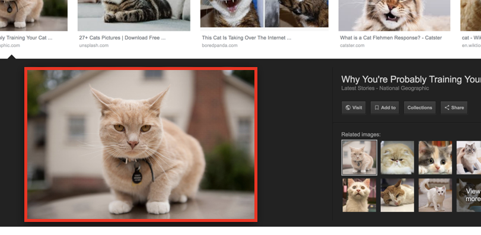

# google-image-crawler
Crawler that collects image search result from google based on scrapy.  
It collects original images (not thumbnails) which are relatively high resolution.  

  
## Install
`pip install -r requirements.txt`

## Run
- Edit keywords in keywords.txt  
- `scrapy crawl google`
- Further options can be set in src/setting.py (ex.num of threads) 
